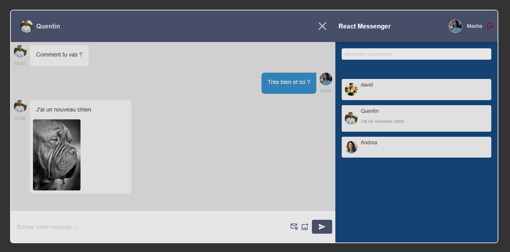

# Application React Messenger

C'est une application de messagerie en temps réel construite avec React et Firebase. Les utilisateurs peuvent s'inscrire, se connecter, démarrer de nouvelles conversations et envoyer et recevoir des messages en temps réel.

## Technologies utilisées

- React.js (hooks, context API)
- React Router
- Firebase
  - Firestore (pour la base de données en temps réel)
  - Authentification Firebase (pour l'authentification des utilisateurs)
  - Stockage Firebase (pour le stockage des images de profil des utilisateurs)
- SASS 
- Material-UI

## Fonctionnalités clés

- Authentification des utilisateurs : Les utilisateurs peuvent créer un compte, se connecter et se déconnecter.
- Chats en temps réel : Les utilisateurs peuvent commencer un chat avec un autre utilisateur et envoyer/recevoir des messages en temps réel.
- Téléchargement d'image : Les utilisateurs peuvent télécharger une image de profil lors de l'inscription.
- Affichage des informations de l'utilisateur : Le nom et l'image de profil de l'utilisateur sont affichés dans le chat.
- Aperçu du dernier message : Le dernier message de chaque chat est affiché sur l'écran principal du chat.
- Recherche d'utilisateurs : Possibilité de rechercher un utilisateur existant via la barre de recherche à l'intérieur du menu burger.

## Installation

1. Clonez ce dépôt sur votre machine locale en utilisant `git clone https://github.com/votre_username/react-messenger-app.git`.
2. Naviguez jusqu'au répertoire du projet : `cd react-messenger-app`.
3. Installez les dépendances : `npm install`.
4. Démarrez le serveur de développement : `npm start`.

## Utilisation

Créez deux utilisateurs et faites les discuter entre eux ( il faudra que l'une des fenêtres soit en navigation privée ).
Pour rechercher un utilisateur :
- Il vous suffit simplement de rentrer son nom dans la barre de recherche qui est cachée dans le menu de droite.
- Puis cliquez sur le résultat de la recherche et cliquez encore une fois sur l'utilisateur qui est apparu en dessous, son nom et son image apparaitront alors en haut de la fenêtre.
- Ensuite il n'y a plus qu'à commencer la conversation.